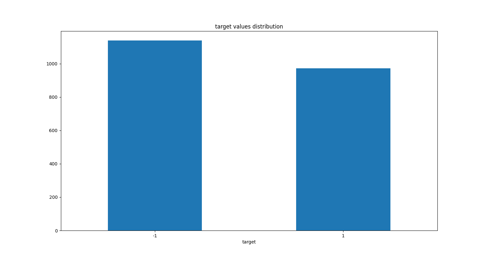
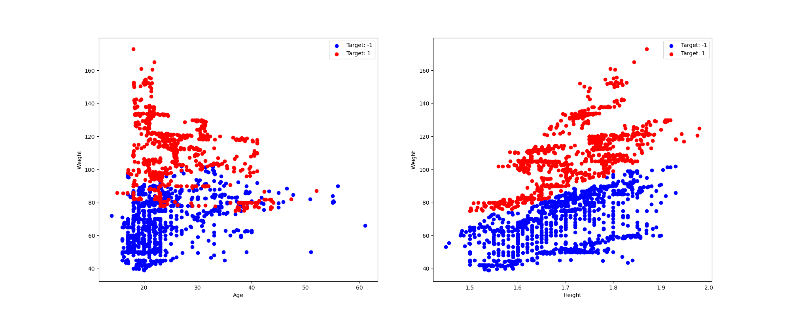
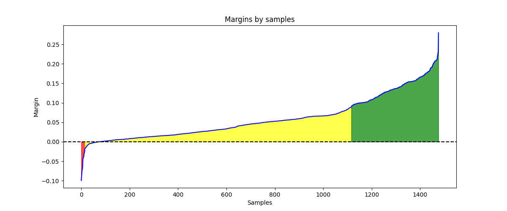

# Лабораторная работа №1

## Задание

1. выбрать датасет для классификации, например на [kaggle](https://www.kaggle.com/datasets?&tags=13304-Clustering);
2. реализовать вычисление отступа объекта (визуализировать, проанализировать);
3. реализовать вычисление градиента функции потерь;
4. реализовать рекуррентную оценку функционала качества;
5. реализовать метод стохастического градиентного спуска с инерцией;
6. реализовать L2 регуляризацию;
7. реализовать скорейший градиентный спуск;
8. реализовать предъявление объектов по модулю отступа;
9. обучить линейный классификатор на выбранном датасете;
   1. обучить с инициализацией весов через корреляцию;
   2. обучить со случайной инициализацией весов через мультистарт;
   3. обучить со случайным предъявлением и с п.8;
10. оценить качество классификации;
11. сравнить лучшую реализацию с эталонной;
12. подготовить отчет.

## Отчёт выполнения

Все описанные шаги выполнялись исключительно с использованием библиотек numpy, pandas, matplotlib и seaborn, без использования каких-либо функций из sklearn (за исключением эталонных линейных классификаторов для сравнения на последнем шаге)

1. В качестве датасета для классификации был выбран [Obesity Prediction Dataset](https://www.kaggle.com/datasets/ruchikakumbhar/obesity-prediction), содержащий информацию о физическом состоянии и активности людей для предстказания уровня ожирения.
   
    **Описание датасета:**
    * Gender: Пол
    * Age: Возраст
    * Height : Рост в метрах
    * Weight : Вес в кг
    * family_history : Страдал ли кто-либо из членов семьи избыточным весом?
    * FAVC : Часто ли вы едите высококалорийную пищу?
    * FCVC : Едите ли вы обычно овощи во время еды?
    * NCP : Сколько основных приемов пищи у вас в день?
    * CAEC : Едите ли вы что-либо между приемами пищи?
    * SMOKE : Курите ли вы?
    * CH2O : Сколько воды вы пьете ежедневно?
    * SCC : Следите ли вы за количеством потребляемых калорий?
    * FAF : Как часто вы занимаетесь физической активностью?
    * TUE : Как часто вы пользуетесь технологическими устройствами, такими как мобильный телефон, видеоигры, телевизор, компьютер и т.д.?
    * CALC : Как часто вы употребляете алкоголь?
    * MTRANS : Каким видом транспорта вы обычно пользуетесь?
    * Obesity (Target Column) : Уровень ожирения
    
    В исходном датасете Obesity принимает множество значений:
    
   
    Но для задачи бинарной классификации был выбран таргет - имеет ли человек ожиение? Таким образом исходные значения были закодированы слудющим образом:
    ```
    Insufficient Weight, Normal Weight, Overweight Level I, Overweight Level II -> target -1
    Obesity Type I, Obesity Type II and Obesity Type III -> target 1
    ```
   Полученный таргет получился достаточно сбалансированным (есть лишь небольшой дисбаланс в сторону -1):
   
   
2. Далее был произведён анализ исходных данных. В датасете пристуствуют как категориальные, так и непрерывные (численные) признаки. Для каждой группы признаков были рассчитаны описательные статистики, а также выведены их распределения.

    * Статистики и распределения численных признаков:
   
    ```
             count       mean        std    min        25%        50%         75%     max  unique  nan  nan %
    Age     2111.0  24.312600   6.345968  14.00  19.947192  22.777890   26.000000   61.00    1402    0    0.0
    Height  2111.0   1.701677   0.093305   1.45   1.630000   1.700499    1.768464    1.98    1574    0    0.0
    Weight  2111.0  86.586058  26.191172  39.00  65.473343  83.000000  107.430682  173.00    1525    0    0.0
    FCVC    2111.0   2.419043   0.533927   1.00   2.000000   2.385502    3.000000    3.00     810    0    0.0
    NCP     2111.0   2.685628   0.778039   1.00   2.658738   3.000000    3.000000    4.00     635    0    0.0
    CH2O    2111.0   2.008011   0.612953   1.00   1.584812   2.000000    2.477420    3.00    1268    0    0.0
    FAF     2111.0   1.010298   0.850592   0.00   0.124505   1.000000    1.666678    3.00    1190    0    0.0
    TUE     2111.0   0.657866   0.608927   0.00   0.000000   0.625350    1.000000    2.00    1129    0    0.0
    target  2111.0  -0.079109   0.997102  -1.00  -1.000000  -1.000000    1.000000    1.00       2    0    0.0
    ```
    
    * Статистики и распределения для категориальных признаков:
    ```text
                   count unique                    top  freq  nan  nan %
    Gender          2111      2                   Male  1068    0    0.0
    family_history  2111      2                    yes  1726    0    0.0
    FAVC            2111      2                    yes  1866    0    0.0
    CAEC            2111      4              Sometimes  1765    0    0.0
    SMOKE           2111      2                     no  2067    0    0.0
    SCC             2111      2                     no  2015    0    0.0
    CALC            2111      4              Sometimes  1401    0    0.0
    MTRANS          2111      5  Public_Transportation  1580    0    0.0
    ```
    
    
    * Также было выдвинуто предположение, что Weight (вес) может быть ключевой по важности фичей, так что для неё также были рассмотрены совместные распредления с признаками Age и Height
    
    
   
    Здесь видно, что основываясь на признаках Weight и Height данные выглядят хорошо линейно-разделымыми

3. На основании анализа исходных данных были выбраны методы для кодирования исходных данных.
    *  Бинарные категориальные признаки кодировались как: no - 0, yes - 1 / female - 0, male - 1
    *  По категориальным признакам CAEC и CALC можно заметить, что они означают различные упорядоченные стадии (нет, иногда, часто, всегда), так что они также были закодированы в один признак от 0 до 1:
        * no - 0 (никогда)
        * Sometimes - 0.5 (50/50)
        * Frequently - 0.8 (близко к всегда, но чаще чем иногда)
        * Always - 1
    * Оставшийся категориальный признак MTRANS был One-Hot закодирован с удалением самого частого значения (Public_Transportation) для уменьшения избыточности
    * Числовые признаки были отнормированы к диапазону от 0 до 1 используя технику нормирования Min-Max
    
4. Полученные готовые признаки были разделены на тренировочную (70%) и тестовую (30%) выборки со стратификацией по таргету.

5. Далее были реализованы все необходимые модули, требуемые в задании в пунтах 2-8:
    * вычисление отступа объекта (визуализация, анализ будет далее) - [исходный код](source/metrics/plot_metrics.py)
    * вычисление градиента функции потерь - [исходный код](source/model/loss.py)
    * рекуррентную оценку функционала качества - [исходный код](source/model/loss.py)
    * метод стохастического градиентного спуска с инерцией - [исходный код](source/model/optimizer.py)
    * L2 регуляризация - [исходный код](source/model/regularization.py)
    * скорейший градиентный спуск - [исходный код](source/model/model.py)
    * предъявление объектов по модулю отступа - [исходный код](source/model/batch_generator.py)
    
6. Далее был реализован [пайплайн](source/train/train.py) для обучения всех моделей согласно пункту 9 задания:
    * С инициализацией весов через корреляцию и предъявлением объектов по модулю отступа
    * С инициализацией весов через корреляцию и случайным предъявлением объектов
    * Через мультистарт с случайной инициализацией весов и предъявлением объектов по модулю отступа
    * Через мультистарт с случайной инициализацией весов и случайным предъявлением объектов
   
7. Обучив все модели, была выбрана лучшая - ей оказаалась модель, обученная через мультистарт с случайной инициализацией весов и предъявлением объектов по модулю отступа. 
   
    Метрики полученной модели на тестовой выборке:
    ```text
    Evaluating best custom model:
    -- Accuracy: 0.9653
    -- Precision: 0.9528
    -- Recall: 0.9729
    -- F1-Score: 0.9627
    
    Confusion Matrix:
                      Actual
                    Positive Negative
    Predict Positive      323       16
            Negative        9      285
    ```
   График истории обучения:
   
   
   Визуализация отступов объектов:
   
   
   Здесь можно заметить, что в целом отсупы модели довольно маленькие (от -0.1 до 0.3) и большая часть объектов попадает в пограничную зону. 
   Такое поведение можно объяснить тем, что функция потерь имеет весьма специфичную структуру и множество моделей, особенно те, 
   что обучались с инициализацией весов через корреляцию, часто застревали в локальных минимумах или оврагах (можно было наблюдать на графике функции потерь), не смотря на моменты градиентов.
   Также L2 регуляризация не слабо съедала веса моделей, сильно прижимая их к 0, а так как все исходнные данные были закодированы в промежуток от 0 до 1, то это сказалось и на выходных значениях.
   
8. Сравнение с эталонными моделями из sklearn.
   
   Здесь обучались 2 модели - LogisticRegression и SVC (Support Vector Machine Classifier)
   
   После обучения и анализа accuracy, лучшей из них оказалась модель логистической регрессии. Она показала следующие метрики:
   ```text
   Evaluating best sklearn model:
   -- Accuracy: 0.9763
   -- Precision: 0.9907
   -- Recall: 0.9639
   -- F1-Score: 0.9771
 
   Confusion Matrix (sklearn):
                      Actual
                    Positive Negative
   Predict Positive      320        3
           Negative       12      298
   ```
   
   Таким образом собственная реализация оказалась лишь чуть хуже, реализации логистической регрессии из sklearn, уступив лишь на 0.011 в accuracy. 

Полный лог предобработки данных, обучения моделей и анализа результатов доступен [тут](logs/full_pipeline_log.txt)
